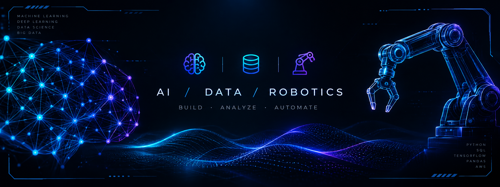
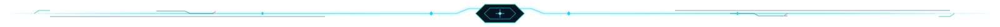
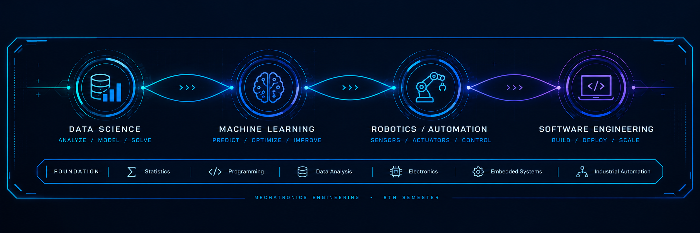
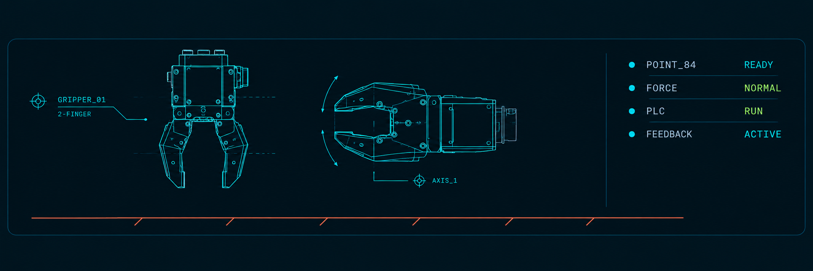
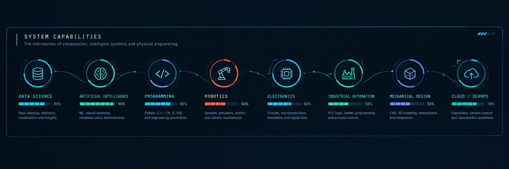

<div align="center">
  
</div>

<h1 align="center">EDSON RUBEN CARRANZA NARVAY</h1>

<p align="center">
  <code>MECHATRONICS ENGINEERING</code> · <code>8TH SEMESTER</code> · <code>DATA SCIENCE + AI</code>
</p>

<p align="center">
  
  
  
</p>

<p align="center">
  <a href="#system-overview">Overview</a> ·
  <a href="#programming-core">Programming</a> ·
  <a href="#ai--data-science">AI & Data</a> ·
  <a href="#mechatronics-engineering">Mechatronics</a> ·
  <a href="#system-capabilities">Capabilities</a> ·
  <a href="#connect">Connect</a>
</p>



## SYSTEM OVERVIEW

<div align="center">

`ARTIFICIAL INTELLIGENCE` → `DATA SCIENCE` → `ROBOTICS / AUTOMATION` → `SOFTWARE ENGINEERING`

*Four domains. One engineering profile.*

</div>

<div align="center">
  
</div>

Mechatronics Engineering student focused on Data Science, AI and intelligent systems.

My background combines statistics, programming, robotics, electronics,
embedded systems and industrial automation. I use Python, SQL and
machine learning to turn data into useful engineering decisions.

My goal is to build intelligent systems that connect computation
with real-world physical systems.


## PROGRAMMING CORE

> A practical stack for moving from data exploration to deployed, physical-world systems.

| Language | Primary use | Current focus |
|---|---|---|
| **Python** | Data, AI, ML and automation | Modeling, analysis, computer vision and tooling |
| **C++** | Embedded systems and performance | Microcontrollers, robotics and real-time logic |
| **C#** | Applications and engineering utilities | Desktop tooling, simulation and integrations |
| **R** | Statistics and exploratory analysis | Statistical reasoning and visualization |
| **SQL** | Data access and transformation | Querying, cleaning and analytical workflows |
| **MATLAB** | Engineering computation | Modeling, simulation and control concepts |

<div align="center">
  
</div>

### Programming workflow

```text
COLLECT → CLEAN → EXPLORE → MODEL → VALIDATE → AUTOMATE → DEPLOY
   │         │        │         │         │          │          │
  SQL      Python   Pandas   ML/DL    Metrics    APIs/CLI   Systems
```

**Core practices:** reproducible notebooks · modular scripts · data validation · version control · readable documentation · testing where it matters.


## AI / DATA SCIENCE

<div align="center">
  
  
  
  
  
  
  
</div>

### Machine learning & neural networks

`MACHINE LEARNING` `DEEP LEARNING` `COMPUTER VISION` `GENERATIVE AI` `LLM` `INFERENCE` `FEATURE ENGINEERING`

- **Classical ML:** regression, classification, clustering, dimensionality reduction and model evaluation.
- **Deep learning:** neural-network fundamentals, training workflows and practical experimentation with PyTorch / TensorFlow.
- **Data work:** NumPy, Pandas, Polars, SciPy, Matplotlib, Seaborn and Jupyter.
- **Vision and AI tooling:** OpenCV, Hugging Face, Google Colab, LM Studio and Ollama.
- **Data platforms:** SQL, MongoDB and introductory distributed-data concepts with Hadoop.


## CLOUD / INFRASTRUCTURE

<div align="center">
  
</div>

<div align="center">

`CLOUD FUNDAMENTALS` · `CONTAINERS` · `INFRASTRUCTURE AS CODE` · `VERSION CONTROL` · `CLI WORKFLOWS`
</div>


## POWER PLATFORM

<div align="center">

`DATA` → `ANALYTICS` → `AUTOMATION` → `BUSINESS PROCESS`


</div>


## MECHATRONICS ENGINEERING

<div align="center">

`ROBOTICS` · `ELECTRONICS` · `MECHANICAL DESIGN` · `AUTOMATION` · `CONTROL`

</div>

### Robotics / Embedded

`ROBOTIC SYSTEMS` `MICROCONTROLLERS` `ACTUATORS` `SENSORS` `SERVO SYSTEMS` `EMBEDDED PROGRAMMING`

<div align="center">
  
</div>

### Electronics


`CIRCUIT DESIGN` `SIMULATION` `MICROCONTROLLERS` `SIGNAL FLOW`

### Mechanical Design


`CAD` `3D MODELING` `MECHANISMS` `DESIGN FOR ASSEMBLY`

### Industrial Automation


```text
INPUT_01     ● OK        SENSOR
OUTPUT_01    ● ACTIVE    ACTUATOR
LOGIC        ● RUNNING   LADDER
```

<sub><i>Panel decorativo / UI data — no representa un sistema en producción.</i></sub>

### Simulation / Engineering Tools

`SCILAB` `FLUIDSIM` `MATLAB` `PROTEUS` `KICAD`


## SYSTEM CAPABILITIES

> Capability map: the intersection of computation, intelligent systems and physical engineering.

| Capability | Signal | What it connects |
|---|---:|---|
| **Data Science** | `████████░░` | Data cleaning, statistics, visualization and insights |
| **Artificial Intelligence** | `█████████░` | ML, neural networks, computer vision and inference |
| **Programming** | `████████░░` | Python, C++, C#, R, SQL and engineering automation |
| **Robotics** | `██████░░░░` | Sensors, actuators, motion and robotic mechanisms |
| **Electronics** | `██████░░░░` | Circuits, microcontrollers, simulation and signal flow |
| **Industrial Automation** | `█████░░░░░` | PLC logic, ladder programming and process control |
| **Mechanical Design** | `█████░░░░░` | CAD, 3D modeling, mechanisms and integration |
| **Cloud / DevOps** | `███████░░░` | Containers, version control and reproducible workflows |

<div align="center">
  
</div>

### Engineering loop

```text
OBSERVE → REPRESENT → PREDICT → DECIDE → ACT → MEASURE → IMPROVE
 sensors     data       model     logic   actuator  feedback   iteration
```


## CONNECT

<div align="center">

<a href="https://www.linkedin.com/in/edson-ruben-carranza-narvay-612256375" aria-label="LinkedIn">
  
</a>
<a href="mailto:ecarranzanarvay767@gmail.com" aria-label="Email">
  
</a>
<a href="https://github.com/asgasgED" aria-label="GitHub">
  
</a>

<br /><br />

```text
ENGINEERING PROFILE
MECHATRONICS + DATA / AI

CURRENT BUILD
APPLIED INTELLIGENT SYSTEMS

CORE LOOP
DATA → MODEL → CONTROL → IMPROVEMENT

NEXT OBJECTIVE
TURNING LEARNING INTO REAL PROJECTS
```

###


###